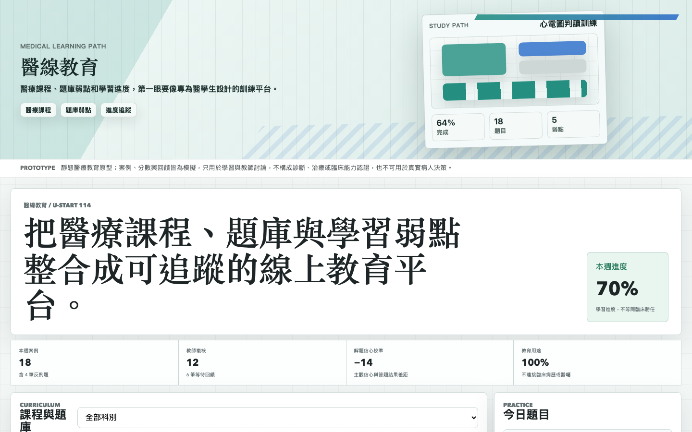
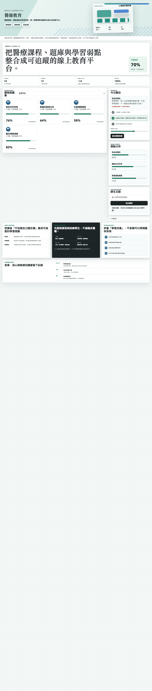

# 醫線教育醫療學習平台原型

## 快速看懂

- 線上 Demo：https://atlasforcn.github.io/startup-medical-line-education/
- 這個原型在做什麼：把醫線教育做成醫療學習與診斷邏輯訓練平台。
- 特色定位：把醫療學習內容變成案例、答題信心、錯因、教師回饋與可稽核練習紀錄。
- 操作流程：選擇課程 → 回答模擬案例並標記信心 → 查看解析與信心偏差 → 更新弱點 → 提交教師討論

展開完整功能流程截圖

## 比賽來源

- 競賽：U-start 創新創業計畫
- 屆次：114 年度第二階段績優團隊
- 得獎作品：醫線教育
- 學校：臺北醫學大學
- 公司：醫線教育有限公司
- 類別：社會企業
- 官方來源：https://ustart.yda.gov.tw/p/405-1000-2178,c147.php?Lang=zh-tw

## 核心概念

依公開名稱與資料庫整理，本原型把醫線教育理解為醫療教育平台：以課程、題庫、學習進度、弱點分析與師生互動，協助醫療學習者建立可追蹤的學習流程。

## 功能

- 醫療課程與題庫清單
- 科別篩選
- 今日題目練習
- 三選一案例題、作答信心與解析
- 弱點分析、信心校準與進度更新
- 師生提問互動
- 市場、商業模式與學習驗證面板
- 教師回饋與學習稽核紀錄

## 市場與商業假設

- 學習者：醫療相關科系學生、實習前學員與持續教育使用者。
- 付費者：學校、課程單位與專業訓練機構。
- 現有替代：LMS、紙本題庫、共享文件與群組討論。
- 收入方向：班級授權、題庫模組、教師後台與機構導入。
- 核心驗證：錯因改善、信心校準、教師回饋工時與同類題進步。

## 醫療教育邊界

- 所有案例與分數均為模擬教育內容。
- 不連接真實病歷、醫囑或臨床決策流程。
- 學習分數不能作為獨立臨床能力或執業資格認證。
- 回饋必須在教師或合格專業人員監督下使用。

## 聲明

本 repo 是依官方公開得獎名稱建立的概念原型，不代表原團隊授權產品，也未使用原團隊商標、素材或未公開資料。內容不構成診斷、治療或臨床建議。
